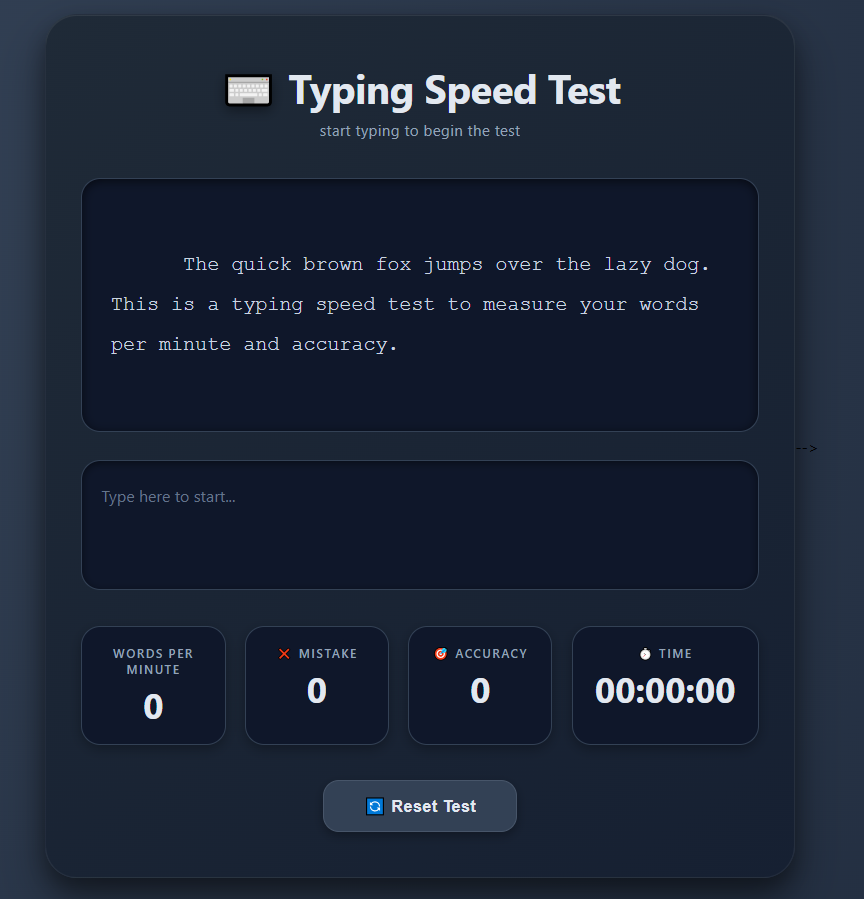

# ⌨️ Typing Speed Test

A simple and beginner-friendly **Typing Speed Test** project built with **JavaScript**, **HTML**, and **CSS**.

This project was created at the beginning of my JavaScript learning journey to practice and demonstrate the core fundamentals of JavaScript programming in a real mini-project.

---

## ✨ Features

- ⏱️ **Timer**
- ❌ **Error counter**
- 🎯 **Accuracy percentage**
- ⚡ **Words Per Minute (WPM) calculation**
- 📝 **Live typing performance tracking**

---

## 📌 Project Purpose

This project is **not a perfect or advanced typing application** — it is a simple practice project made to apply basic JavaScript concepts such as:

- Variables
- Functions
- Conditions
- DOM manipulation
- Event handling
- Timing with `setInterval`

The main goal of this project was to strengthen my understanding of JavaScript logic and how to use it inside a practical user interface.

---

## 🛠️ Technologies Used

- **HTML** – page structure
- **CSS** – styling and layout
- **JavaScript** – functionality and calculations

---

## 🚀 How It Works

1. The user starts typing the displayed text.
2. The timer begins counting.
3. The project tracks:
   - typing speed
   - number of mistakes
   - accuracy percentage
   - WPM
4. Results are updated during the typing process.

---

## 💡 What I Learned

Through building this project, I learned and practiced:

- How to work with JavaScript events
- How to calculate typing speed
- How to compare typed text with the original text
- How to update the DOM dynamically
- How to manage time-based logic in JavaScript

---

## ⚠️ Note

This is a **simple learning project** made while I was just starting to learn JavaScript.  
It may contain mistakes or areas that can be improved, but it was built mainly to show the application of basic JavaScript rules and concepts in a practical project.

---

## 📷 Preview

